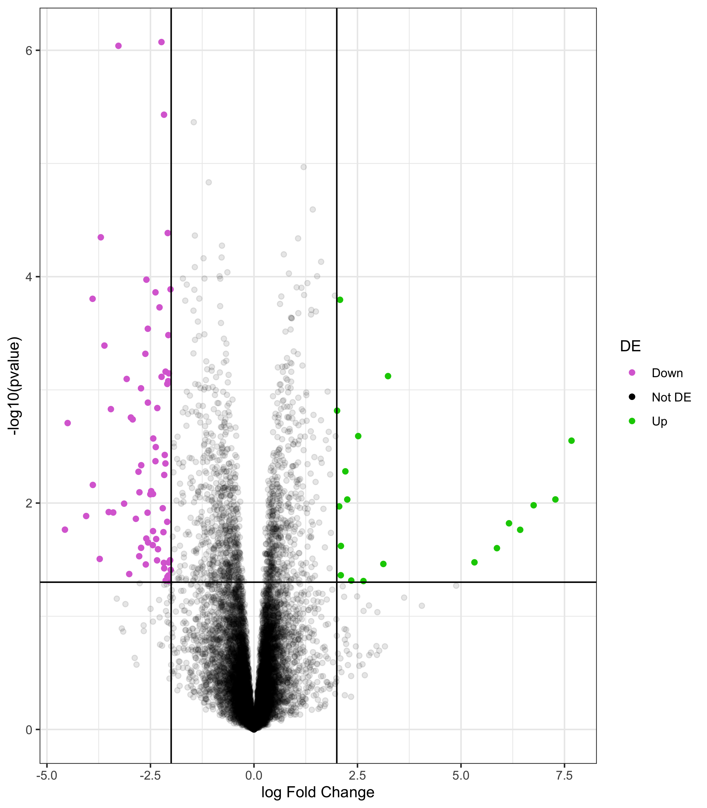

<!-- README.md is generated from README.Rmd. Please edit that file -->

# tidyde

Perform differential expression analysis in a tidy way. Currently in
early development. Only `limma` is supported.

## Installation

`tidyde` requires the development version of several packages, including
`ggplot2`, to function correctly. You can install the required packages
for this vignette with the following code:

``` r
install.packages(c("devtools", "tidyverse", "rlang"))
if (!requireNamespace("BiocManager", quietly = TRUE))
    install.packages("BiocManager")
BiocManager::install("edgeR")
library(devtools)
install_github("latlio/tidyde")
```

# Tidy Differential Expression analysis

`tidyde` is a toolkit for working with gene differential expression
analysis in R. Currently, it includes a sample count data set, called
`GSE60450_Lactation-GenewiseCounts`, and sample metadata, called
`SampleInfo_Corrected`.

``` r
library(tidyde)
library(readr)
library(purrr)
library(dplyr)
library(stringr)
library(edgeR)
library(ggplot2)
counts <- read_delim("data/GSE60450_Lactation-GenewiseCounts.txt",
                     delim = "\t")
meta <- read_delim("data/SampleInfo_Corrected.txt",
                   delim = "\t") %>%
  mutate(FileName = str_replace(FileName, "\\.", "-"))
```

`tidyde` is composed of wrapper functions of the `limma` package that
perform various steps of a standard differential expression analysis in
a tidy way.

``` r
# Set up objects
meta <- read_delim("data/SampleInfo_Corrected.txt",
                   delim = "\t") %>%
  mutate(FileName = str_replace(FileName, "\\.", "-"))
#> 
#> ── Column specification ────────────────────────────────────────────────────────
#> cols(
#>   FileName = col_character(),
#>   SampleName = col_character(),
#>   CellType = col_character(),
#>   Status = col_character()
#> )

my_design <- check_sample_names(counts, c(1,2), meta, FileName) %>%
  purrr::pluck("meta") %>%
  make_design_matrix(., c("Status"))
#> The column names of the count matrix and the unique sample ID values are correctly specified.
#> The order is also correct. You can safely proceed with the remaining analysis steps.
#> The proportion of zeroes in your count data is  0.2936958

id <- as.character(counts$EntrezGeneID)

# Analysis
res <- check_sample_names(counts, c(1,2), meta, FileName) %>%
  purrr::pluck("mod_count") %>%
  filter_genes(., id, "edgeR") %>%
  make_voom(., my_design) %>%
  model_limma() %>%
  make_contrasts(design_matrix = my_design, Statuspregnant, Statusvirgin) %>%
  model_bayes()
#> The column names of the count matrix and the unique sample ID values are correctly specified.
#> The order is also correct. You can safely proceed with the remaining analysis steps.
#> The proportion of zeroes in your count data is  0.2936958
#> Warning in filterByExpr.DGEList(dge, ...): All samples appear to belong to the
#> same group.
```

`tidyde` includes `broom`-like methods for cleaning differential
expression fit results, although it currently is not officially
supported by `broom`. I’m actively working on that. The `tidy()`
function in `broom` puts results into a tidy data frame.

``` r
tidy.marray.lm(res)
#> # A tibble: 11,532 x 8
#>    gene    estimate std.error statistic p.value conf.low conf.high
#>    <chr>      <dbl>     <dbl>     <dbl>   <dbl>    <dbl>     <dbl>
#>  1 27395   0.173        0.686   0.580    0.574  -0.484       0.829
#>  2 18777   0.404        0.267   2.50     0.0298  0.0479      0.760
#>  3 21399   0.0261       0.442   0.131    0.898  -0.415       0.467
#>  4 108664  0.572        1.33    1.65     0.129  -0.195       1.34 
#>  5 12421  -0.000491     0.455  -0.00242  0.998  -0.448       0.447
#>  6 319263  0.382        0.348   2.15     0.0549 -0.00967     0.773
#>  7 59014   0.201        0.794   0.752    0.468  -0.390       0.793
#>  8 76187   1.42         7.42    1.21     0.253  -1.18        4.03 
#>  9 17864  -0.859        2.31   -1.50     0.163  -2.12        0.406
#> 10 70675  -0.0639       0.415  -0.330    0.748  -0.491       0.364
#> # … with 11,522 more rows, and 1 more variable: stringsAsFactors <lgl>
```

# Visualization for Meta-Analysis

`tidyde` includes functionality for working with results in `ggplot2`,
including quick plots for common visualizations.

With tidy data, most data visualizations for meta-analyses are easy to
build from the ground up. Nevertheless, `tidyde` has several quick plot
functions to make the process easier. For example, `volcano_plot()`
takes a tidied DE analysis and plots a volcano plot.

``` r
tidy.marray.lm(res) %>%
  volcano_plot()
```


Because the results are still `ggplot2` objects, it’s easy to make
changes to the plot.

``` r
tidy.marray.lm(res) %>%
  volcano_plot() + 
  theme_minimal()
```



`tidyde` currently supports boxplots of counts, PCA plots, and volcano
plots.
